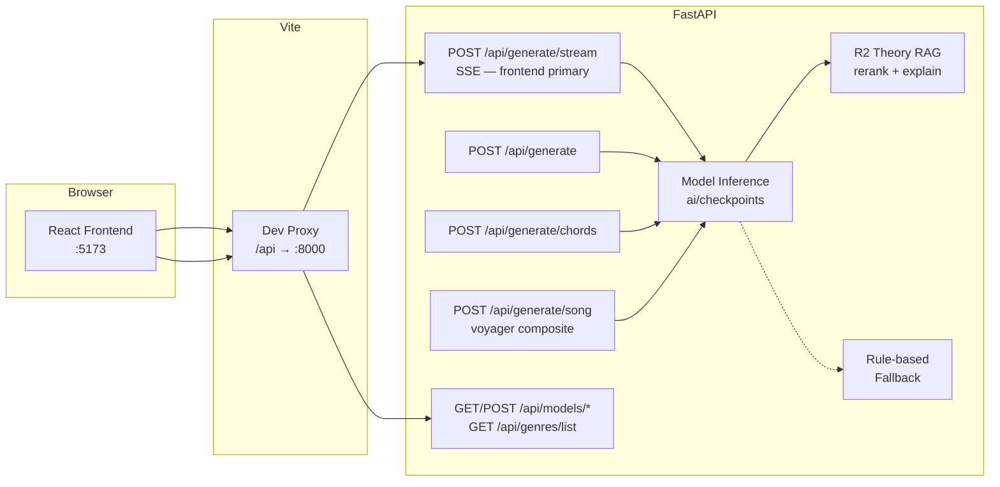
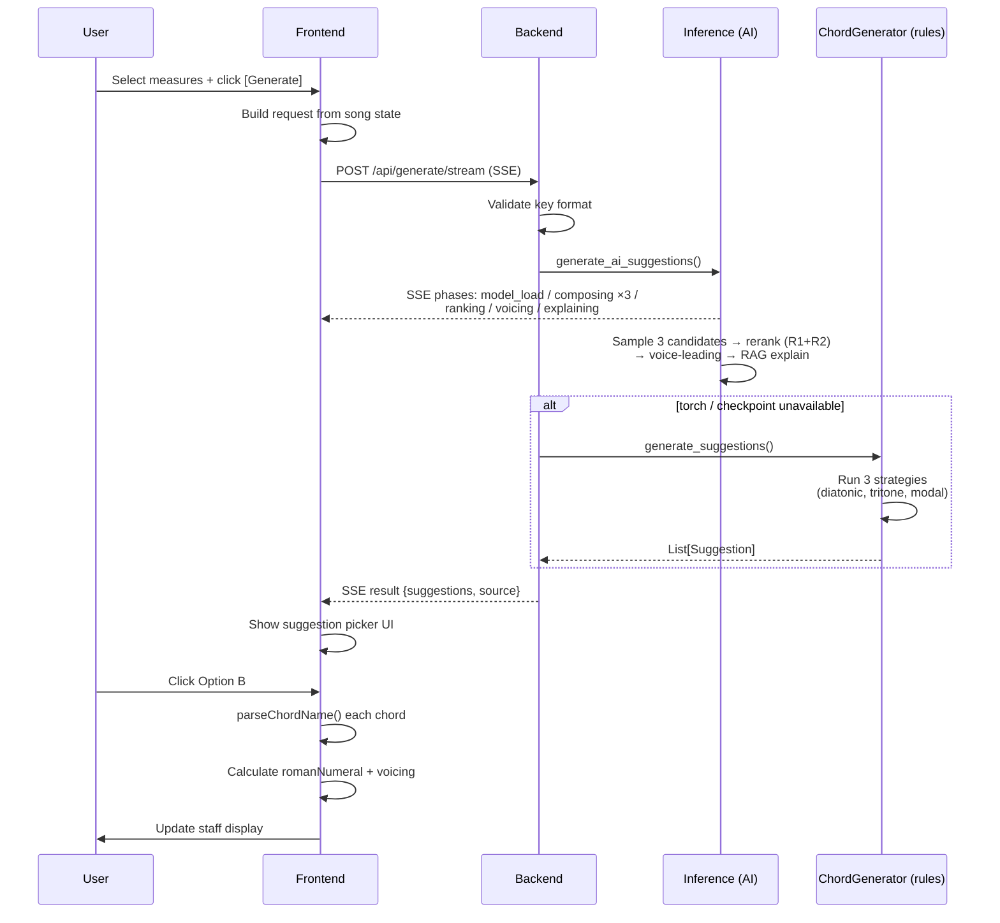

# TheArtist — API Specification

> Contract between `frontend/` and `backend/`

---

## Architecture Overview



(`POST /api/export` is planned, not implemented — no route exists in the backend yet.)

## Base URL

```
Development: http://localhost:8000/api
Production:  TBD
```

Vite dev server proxies `/api` → `http://localhost:8000/api` (configured in `vite.config.ts`).

---

## Endpoints

### GET `/api/health`

Health check. Returns `{ "status": "ok" }`.

### POST `/api/generate`

Generate chord suggestions for selected measures. Used by the frontend chord editor.

**Status:** Implemented — AI inference (Music Transformer) with rule-based fallback.

**Request:**

```json
{
  "key": "G major",
  "bpm": 80,
  "genre": "jazz",
  "modelKey": "ft_f4",
  "timeSignature": [4, 4],
  "context": [
    { "measure": 0, "chords": ["Gmaj7", "Em7"] },
    { "measure": 1, "chords": ["Am7", "D7"] },
    { "measure": 2, "chords": [null, null] },
    { "measure": 3, "chords": [null, null] }
  ],
  "selectedMeasures": [2, 3],
  "sectionType": "verse"
}
```

| Field | Type | Description |
|-------|------|-------------|
| `key` | `string` | Key signature, e.g. `"C major"`, `"A minor"` |
| `bpm` | `number` | Tempo (20-300) |
| `genre` | `string \| null` | Genre hint — any key of the 13-genre vocabulary: `"jazz"`, `"pop"`, `"rock"`, `"blues"`, `"bossa"`, `"classical"`, `"country"`, `"rnb_soul"`, `"hip_hop"`, `"electronic"`, `"funk"`, `"folk"`, `"gospel"` — or `null` |
| `modelKey` | `string \| null` | Checkpoint to use: `"phase0"`, `"ft_f1"`…`"ft_f5"`, `"ft_f1_v2"`, or `"ft_f1_lora_<genre>"` (R4 LoRA adapters). Default: `ft_f1` (recommended pop-preserving baseline). If `null` and `genre` is provided, backend dispatches via `GENRE_MODEL_DISPATCH`. See [Model Checkpoints](#model-checkpoints). |
| `timeSignature` | `[number, number]` | e.g. `[4, 4]`, `[3, 4]`, `[6, 8]` |
| `context` | `ContextMeasure[]` | All measures in the song with existing chords |
| `selectedMeasures` | `number[]` | Indices of measures to generate chords for |
| `sectionType` | `string \| null` | `"intro" \| "verse" \| "chorus" \| "bridge" \| "outro"` — applies song-form post-processing |

**Response (200):**

```json
{
  "suggestions": [
    {
      "label": "Option A — Diatonic — ii-V voice leading",
      "chords": {
        "2": ["Bm7", "E7"],
        "3": ["Am7", "D7"]
      },
      "explanations": [
        {
          "chord_a": "Bm7",
          "chord_b": "E7",
          "concept": "ii-V",
          "explanation": "Bm7 → E7 forms a ii-V unit targeting A...",
          "chapter": "2",
          "section": "The II V",
          "page_start": 17,
          "page_end": 19
        }
      ]
    },
    {
      "label": "Option B — Tritone substitution",
      "chords": {
        "2": ["Bm7", "Ab7"],
        "3": ["Am7", "Ab7"]
      },
      "explanations": null
    },
    {
      "label": "Option C — Modal interchange",
      "chords": {
        "2": ["Bbmaj7", "Eb7"],
        "3": ["Am7", "Dm7"]
      },
      "explanations": null
    }
  ],
  "source": "ai"
}
```

| Field | Type | Description |
|-------|------|-------------|
| `suggestions` | `Suggestion[]` | 1-5 chord progression options |
| `suggestions[].label` | `string` | Human-readable description of harmonic approach |
| `suggestions[].chords` | `Record<string, [string, string]>` | Measure index → 2 chord names (slot 0, slot 1) |
| `suggestions[].explanations` | `TheoryExplanation[] \| null` | Per-transition theory pointers from the R2 RAG layer (`RAG_ENABLED_GENRES` only — jazz family + classical; `null` otherwise). Each: `{chord_a, chord_b, concept, explanation, chapter, section, page_start, page_end}`. |
| `source` | `"ai" \| "rules"` | Which generator produced the suggestions (`"rules"` = rule-based fallback fired). |

**Error (4xx):**

```json
{
  "detail": "Expected key format: 'C major' or 'A minor'"
}
```

**Current strategies (rule-based fallback):**
1. **Diatonic ii-V** — weighted diatonic chord selection, ending with ii-V targeting I
2. **Tritone substitution** — ii → bII7 instead of ii → V7
3. **Modal interchange** — borrow chords from parallel major/minor

---

### POST `/api/generate/stream`

Streaming variant of `/api/generate` — **the frontend's primary generate path** (`frontend/src/engine/chordGenerator.ts` calls this to drive the live progress UI; plain `/api/generate` remains the non-streaming equivalent for programmatic callers).

**Status:** Implemented — same request body and validation as `/api/generate`. Response is `text/event-stream` (SSE; served with `X-Accel-Buffering: no` + `Cache-Control: no-cache` so frames are not proxy-buffered).

**Request:** identical to `/api/generate`.

**SSE frames** (event name = inference pipeline phase; one frame per event — see `backend/app/routes/generate.py` + `app/services/inference.py`):

| Event | Payload | When |
|-------|---------|------|
| `model_load` | `{"label": "Loading <model label>"}` | Only when the checkpoint is cold (first request after startup / model switch). |
| `composing` | `{"label", "step", "total", "creativity"}` | ×3 — one per temperature pass; `step` 1-3, `total` 3, `creativity` ∈ `conservative` (0.7) / `balanced` (0.9) / `creative` (1.1). |
| `ranking` | `{"label": "Scoring consonance and theory grounding"}` | Composite rerank stage (R1 consonance + R2 theory). |
| `voicing` | `{"label": "Picking inversions for smooth bass motion"}` | Unless disabled via `THEARTIST_DISABLE_VOICE_LEADING`. |
| `explaining` | `{"label": "Generating per-transition theory explanations"}` | RAG-enabled genres only (jazz family + classical). |
| `complete` | `{"label": "Done"}` | Right before `result`. |
| `result` | Same payload shape as `/api/generate`'s 200 JSON (`{suggestions, source}`) | Final frame, then the stream closes. |
| `error` | `{"detail": "..."}` | Terminal — validation errors are streamed as an `error` frame instead of an HTTP 4xx. |

If torch is unavailable, no phase frames fire — the rule-based fallback runs and only the `result` frame arrives, with `"source": "rules"`. If torch is present but the checkpoint has not been downloaded, a `model_load` frame fires first (the registry attempts the load), then the load fails and the same rule-based `result` arrives.

---

### POST `/api/generate/chords`

Simplified chord-generation endpoint for **programmatic callers** (TheVoyager and similar). Returns a flat list of bars instead of measure-keyed suggestions.

**Status:** Implemented — same AI inference path as `/api/generate` with rule-based fallback.

**Request:**

```json
{
  "key": "A minor",
  "genre": "jazz",
  "time_signature": [4, 4],
  "bpm": 110,
  "n_bars": 8,
  "context_bars": null,
  "temperature": 0.8,
  "model": "ft_f4",
  "n_candidates": 1
}
```

| Field | Type | Description |
|-------|------|-------------|
| `key` | `string` | Same format as `/api/generate` |
| `genre` | `string \| null` | Genre hint. 13-genre vocab: `jazz`, `pop`, `rock`, `blues`, `bossa`, `classical`, `country`, `rnb_soul`, `hip_hop`, `electronic`, `funk`, `folk`, `gospel` (alias: `bossa nova` → `bossa`). The serving tokenizer is the extended 359-vocab with a `[GENRE:<name>]` token per genre; genres outside the vocab fall through to unconditioned (`[GENRE:none]`). |
| `time_signature` | `[number, number]` | Default `[4, 4]` |
| `bpm` | `number \| null` | Optional BPM hint (20-300). Currently echoed in response; not encoded into the prompt (the trained tokenizer has no BPM-bucket tokens). Reserved for a future training round. |
| `n_bars` | `number` | Number of bars to generate (1-32) |
| `context_bars` | `string[][] \| null` | Optional preceding bars, e.g. `[["Cmaj7","Am7"],["Dm7","G7"]]` |
| `temperature` | `number` | Sampling temperature (0.1-2.0). Default `0.8` |
| `model` | `string` | Same checkpoint keys as `modelKey` above (`phase0` / `ft_f1`...`ft_f5` / `ft_f1_v2` / `ft_f1_lora_<genre>`). Defaults to `ft_f1` if omitted. |
| `n_candidates` | `number` | Default `1`. Range `1-5`. When `>1`, multiple chord progression candidates are returned with varied temperature for diversity. Response shape branches on this field (see below). |

**Response (200) — when `n_candidates=1` (default, backward-compat):**

```json
{
  "bars": [
    {"chords": ["Am7", "Fmaj7"]},
    {"chords": ["Cmaj7", "G7"]}
  ],
  "key": "A minor",
  "genre": "jazz",
  "bpm": 110,
  "model_used": "ft_f4"
}
```

**Response (200) — when `n_candidates > 1`:**

```json
{
  "candidates": [
    {"bars": [{"chords": ["Am7", "Fmaj7"]}, ...], "temperature": 0.6, "seed": null},
    {"bars": [{"chords": ["Am", "F"]}, ...],     "temperature": 0.8, "seed": null},
    {"bars": [{"chords": ["Am7", "Dm7"]}, ...], "temperature": 1.0, "seed": null}
  ],
  "key": "A minor",
  "genre": "jazz",
  "bpm": 110,
  "model_used": "ft_f4"
}
```

`model_used` echoes the actual checkpoint name (or `"rules"` if AI fallback fired). `bpm` echoes the request value (`null` if not provided). `temperature` per candidate is the actual temperature used for sampling (spread around `req.temperature` for diversity). `seed` is `null` (reserved for deterministic sampling).

---

### Model Checkpoints

`modelKey` (and `model` on `/api/generate/chords`) selects from the paper experiment checkpoints in `ai/checkpoints/` (gitignored — fetch from HuggingFace with `uv run --with huggingface_hub python model/_download.py`. Without them, every key falls through to rule-based generation):

| Key | Checkpoint dir | Description |
|-----|---------------|-------------|
| `phase0` | `phase0_pop_baseline` | Pop pretrain baseline (no jazz fine-tune) |
| `ft_f1` | `ft_jazz_pop80` | F1 — jazz + 10K pop mix (safest pop) |
| `ft_f1_v2` | `ft_jazz_pop80_v2` | F1 v2 — selection-corrected retrain (best checkpoint chosen on jazz-only val; hash-distinct from Phase 0). Standalone key; LoRA adapters keep pairing with `ft_f1`. |
| `ft_f2` | `ft_jazz_pop67` | F2 — 5K pop mix |
| `ft_f3` | `ft_jazz_pop50` | F3 — 2.5K pop mix (paper sweet-spot finding) |
| `ft_f4` | `ft_jazz_pop29` | F4 — 1K pop mix (jazziest, TheVoyager default for jazz) |
| `ft_f5` | `ft_jazz_only` | F5 — jazz only |

If `modelKey` is `null` or unknown and `genre` is provided, the backend uses `dispatch_model_for_genre(genre)` to pick the LoRA adapter (or fall back to `ft_f1` if the adapter isn't trained yet). If both are null/unknown, falls back to `DEFAULT_MODEL` = `ft_f1` (Pearl-recommended pop-preserving baseline as of 2026-05-09). Authoritative source: `app/services/inference.py:CHECKPOINTS` + `GENRE_MODEL_DISPATCH`.

**LoRA adapter keys (R4, 2026-05-09)**: `ft_f1_lora_country`, `ft_f1_lora_funk`, `ft_f1_lora_gospel`, `ft_f1_lora_rnb_soul`, `ft_f1_lora_hip_hop`, `ft_f1_lora_electronic`, `ft_f1_lora_folk`, `ft_f1_lora_classical`, `ft_f1_lora_rock`, `ft_f1_lora_blues`, `ft_f1_lora_bossa`. Each is F1 base + LoRA adapter (adapter file 0.4–6 MB depending on rank). Available when adapter dir exists at `ai/checkpoints/<key>/adapter/`. Until trained, requests fall through to F1 base via `dispatch_model_for_genre`.

**Model management endpoints** (`backend/app/routes/models.py`):

| Endpoint | Response | Purpose |
|---|---|---|
| `GET /api/models/status` | `{torch_available, models: {<key>: bool}}` | Per-checkpoint loaded state in the model registry. |
| `POST /api/models/warmup` | `{torch_available, loaded: {...}}` | Preload checkpoints into memory. |
| `GET /api/models/list` | `{default, models: [...], groups: {paper, lora}}` — each entry `{key, label, available, recommended}` | Populates the frontend model dropdown; the frontend filters out `available: false` keys. `recommended` = F1 + F1 v2 + F4. |
| `GET /api/genres/list` | `{default_genre, genres: [...]}` — each entry `{key, label, model_key, served_by, lora_ready}` | 13-genre vocabulary; `served_by` = actual checkpoint each genre routes to (LoRA fallback to F1). |

---

### POST `/api/generate/song` — Composite (chord + arrangement, voyager primary)

> **Status: Live**. Voyager primary path. Artist owns all musical-domain decisions internally; voyager sends only `genre` + `length_bars`.

Generate a full **3-track** song (harmony + bass + drum) in one call. Internally composes the chord progression on the genre-appropriate checkpoint, then layers harmony comping rhythm + bass + drum on top, returning symbolic events plus a base64 MIDI.

> **Melody layer was dropped 2026-05-10** — rationale: alignment-data scarcity + license posture. Variety previously carried by melody now lives in the harmony layer's per-genre comping rhythm + the user's instrument override.

**Request:**

```json
{
  "genre": "jazz",
  "length_bars": 8,
  "n_candidates": 1,
  "seed": null
}
```

| Field | Type | Description |
|---|---|---|
| `genre` | `string` | One of 13 vocab: `jazz, pop, rock, blues, bossa, classical, country, rnb_soul, hip_hop, electronic, funk, folk, gospel`. Required. |
| `length_bars` | `int` | 1-64. Default 8. |
| `n_candidates` | `int` | 1-3. Default 1. (Reserved — current build always returns 1.) |
| `seed` | `int \| null` | Optional. Reserved for deterministic sampling. |

**Response (n_candidates=1):**

```json
{
  "genre": "jazz",
  "key": "F major",
  "bpm": 110,
  "time_signature": [4, 4],
  "bars": [
    {"chords": ["Fmaj7", "Dm7"]},
    {"chords": ["Gm7",  "C7"]}
  ],
  "tracks": {
    "harmony": {
      "events": [
        {"bar": 0, "beat": 0.0, "pitch": 65, "duration": 1.7, "velocity": 0.7},
        {"bar": 0, "beat": 0.0, "pitch": 69, "duration": 1.7, "velocity": 0.7},
        ...
      ],
      "instrument": "electric_piano_1",
      "source": "rule"
    },
    "bass": {
      "events": [
        {"bar": 0, "beat": 0.0, "pitch": 41, "duration": 0.9, "velocity": 0.6},
        ...
      ],
      "instrument": "contrabass",
      "source": "rule"
    },
    "drum": {
      "events": [
        {"bar": 0, "beat": 0.0, "voice": "R", "duration": 0.25, "velocity": 1.0},
        {"bar": 0, "beat": 1.0, "voice": "R", "duration": 0.25, "velocity": 0.9},
        ...
      ],
      "instrument": "gm_drum_kit",
      "source": "rule"
    }
  },
  "midi_b64": "TVRoZAAAAAYAAQAEAeBNVHJrAAAAEgD/UQMHQUkA/1gEBAIYCAD/LwBNVHJrAA...",
  "model_used": "ft_f4"
}
```

**Field semantics:**

| Field | Type | Description |
|---|---|---|
| `genre, key, bpm, time_signature` | echo | Echoes the resolved request context. `key`/`bpm`/`time_signature` come from `services/genre_tables.py:GENRE_DEFAULTS`. |
| `bars[i].chords` | `[str, str]` | Two chord slots per measure (slot 0 = beats `[0, beats_per_measure/2)`, slot 1 = `[beats_per_measure/2, beats_per_measure)`). |
| `tracks.<name>.events[].bar` | `int` | 0-indexed bar position (`0 ≤ bar < length_bars`). |
| `tracks.<name>.events[].beat` | `float` | Bar-relative beat position in `[0, beats_per_measure)`. |
| `tracks.<name>.events[].pitch` | `int \| null` | MIDI note (harmony / bass). `null` for drum events; use `voice` instead. |
| `tracks.<name>.events[].voice` | `str \| null` | Drum voice letter (`K` kick, `S` snare, `H` closed hi-hat, `O` open hi-hat, `X` cross-stick, `C` crash, `R` ride, `T` hi tom, `M` mid tom, `L` low/floor tom). `null` for harmony / bass. |
| `tracks.<name>.events[].duration` | `float` | Beats. Auto-scales with pattern density for harmony (sparse → sustained, dense → stab). |
| `tracks.<name>.events[].velocity` | `float` | 0–1. |
| `tracks.<name>.instrument` | `str` | GM Soundfont snake_case name for harmony/bass; `gm_drum_kit` for drum. Pick a sample bank that matches. |
| `tracks.<name>.source` | `"rule"` | All three layers are deterministic-rule in v1. Reserved for `"learned"` if a learned bass/melody Transformer ships in v2. |
| `midi_b64` | `str` | Multi-track MIDI binary (base64). 4 tracks: meta (tempo + time-sig), harmony (channel 0), bass (channel 1), drum (channel 9). Convenience render — voyager can ignore and re-render from event JSON if it has its own pipeline. |
| `model_used` | `str` | The chord-generation checkpoint key (e.g. `ft_f4`, `ft_f1_lora_country`, or `rules` for the rule fallback path). |

**Genre defaults table** (`backend/app/services/genre_tables.py:GENRE_DEFAULTS`):

| Genre | key | bpm | time_signature |
|---|---|---|---|
| `jazz` | F major | 110 | 4/4 |
| `pop` | C major | 110 | 4/4 |
| `rock` | E major | 120 | 4/4 |
| `blues` | E major | 90 | 4/4 |
| `bossa` | F major | 110 | 4/4 |
| `classical` | C major | 80 | 4/4 |
| `country` | G major | 100 | 4/4 |
| `rnb_soul` | Bb major | 90 | 4/4 |
| `hip_hop` | A minor | 90 | 4/4 |
| `electronic` | A minor | 128 | 4/4 |
| `funk` | F major | 110 | 4/4 |
| `folk` | G major | 100 | 4/4 |
| `gospel` | F major | 90 | 4/4 |

**Internal flow:**
1. `dispatch_model_for_genre(genre)` → checkpoint (jazz→F4, pop→F1, others→matching LoRA, fallback to F1 base if a LoRA dir is absent).
2. `genre_defaults(genre)` → `key` / `bpm` / `time_signature`.
3. Run chord generation (AI when `TORCH_AVAILABLE` and the checkpoint loads, else rule fallback) → `bars`.
4. `song_builder.build_harmony_events / build_bass_events / build_drum_events` → 3 layered events.
5. `song_builder.render_midi` → base64 MIDI.

**Errors:**

| Status | Body | When |
|---|---|---|
| 400 | `{"detail": "Unsupported genre '<x>'. Expected one of: ..."}` | Genre not in the 13-vocab. |
| 422 | Pydantic validation | `length_bars` out of `[1, 64]`, `n_candidates` out of `[1, 3]`, or missing `genre`. |

---

## Data Types (shared)

### Chord Name Format

Standard chord symbol string: `{root}{quality}` with optional slash bass: `{root}{quality}/{bass}`

- Root: `C`, `C#`, `Db`, `D`, `D#`, `Eb`, `E`, `F`, `F#`, `Gb`, `G`, `G#`, `Ab`, `A`, `A#`, `Bb`, `B`
- Quality: `maj7`, `m7`, `7`, `m7b5`, `dim7`, `aug`, `sus2`, `sus4`, `6`, `m6`, `9`, `m9`, `maj9`, `11`, `13`, `add9`, `mMaj7`, `7b9`, `7#9`, `7#11`, `7b13`
- Major triad: root only (e.g. `"C"` = C major)
- Minor triad: `"Cm"` or `"Cmin"`
- Slash chords: `Cmaj7/G`, `Am7/E`

### Frontend Chord Object

```typescript
interface Chord {
  root: string;
  quality: string;
  bass?: string;           // slash chord bass note, e.g. "G" in C/G
  romanNumeral: string;    // calculated client-side
  voicing: number[];       // MIDI notes, calculated client-side
  extensions: string[];
}
```

The backend returns chord **names** (strings). The frontend parses them into `Chord` objects and calculates `romanNumeral` and `voicing` locally.

### Supported Qualities

Base: `maj`, `min`, `dim`, `aug`, `5` (power chord)

Extensions: `6`, `7`, `maj7`, `9`, `maj9`, `11`, `13`

Add: `add2`, `add4`, `add9`, `add11`

Sus: `sus2`, `sus4`

Alterations: `b5`, `#5`, `b9`, `#9`, `#11`, `b13`

Compound: `m7`, `m9`, `m11`, `m13`, `m6`, `mMaj7`, `dim7`, `m7b5`, `7b9`, `7#9`, `7#11`, `7b13`

---

## Request Flow



---

## Backend Implementation

### Implemented Files

```
backend/
├── app/
│   ├── main.py                 # FastAPI app, CORS (localhost:5173); registers the four
│   │                           # routers below + GET /api/health + optional startup warmup
│   ├── routes/
│   │   ├── generate.py         # POST /api/generate + /api/generate/stream (SSE)
│   │   ├── chords.py           # POST /api/generate/chords (programmatic / TheVoyager)
│   │   ├── song.py             # POST /api/generate/song (voyager composite, 3-track)
│   │   └── models.py           # GET/POST /api/models/* + GET /api/genres/list
│   ├── services/
│   │   ├── chord_generator.py  # 3-strategy rule-based generator (fallback)
│   │   ├── inference.py        # Model registry + AI pipeline (R1+R2 rerank, RAG explain)
│   │   ├── genre_tables.py     # GENRE_DEFAULTS + per-genre rhythm/instrument tables
│   │   ├── song_builder.py     # Harmony/bass/drum event layering + MIDI render
│   │   ├── song_form.py        # Song-form post-processor (sectionType)
│   │   └── voice_leading.py    # Bass-motion inversion picker
│   └── models/
│       └── schemas.py          # Pydantic: Generate*, ChordGenerate*, SongGenerate*,
│                               # Track/TrackEvent, Suggestion, TheoryExplanation
├── pyproject.toml              # deps: fastapi, uvicorn, pydantic
└── uv.lock
```

### Running

```bash
cd backend
uv run uvicorn app.main:app --reload   # localhost:8000
```

### Model Inference (implemented)

The Music Transformer checkpoints are trained (Phase 0 + F1–F5 + 11 LoRAs, served from `ai/checkpoints/`) and `/api/generate` (+ `/api/generate/stream`) runs the full pipeline in `app/services/inference.py`:

1. Resolve checkpoint (`modelKey` → genre dispatch via `GENRE_MODEL_DISPATCH` → `DEFAULT_MODEL`) and lazy-load via `ModelRegistry`
2. Tokenize context with the extended 359-vocab tokenizer (13 genre tokens)
3. Sample 3 candidates at temperatures 0.7 / 0.9 / 1.1 (conservative / balanced / creative)
4. Rerank by composite score: R1 (Sethares sensory consonance) + R2 (theory retrieval)
5. Inject voice-leading (bass-motion inversions)
6. Attach RAG theory explanations (jazz-family + classical genres only)

The rule-based generator remains the fallback when torch or the chosen checkpoint is unavailable.
