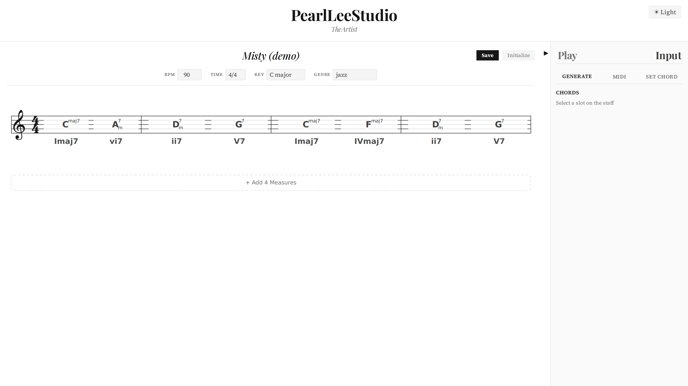
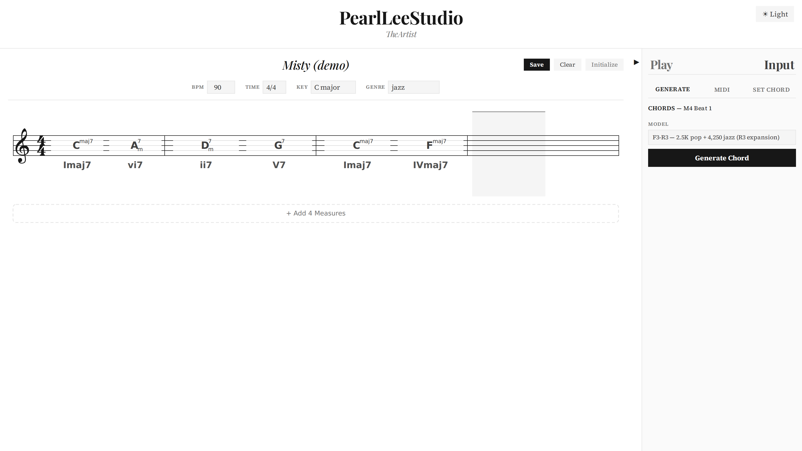
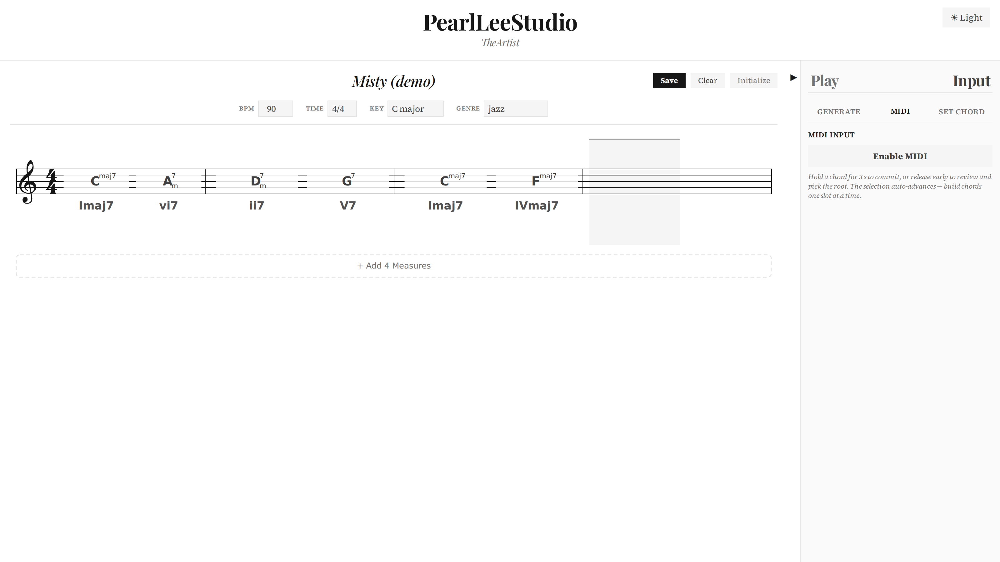
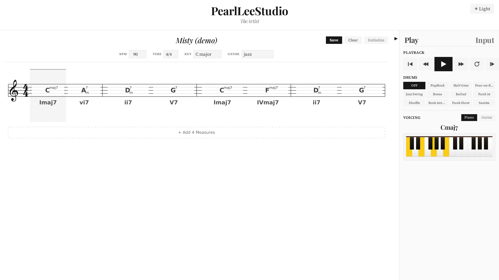
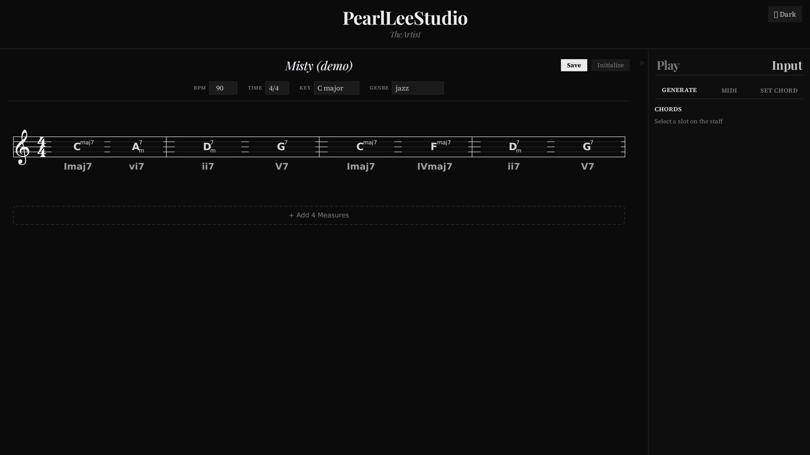
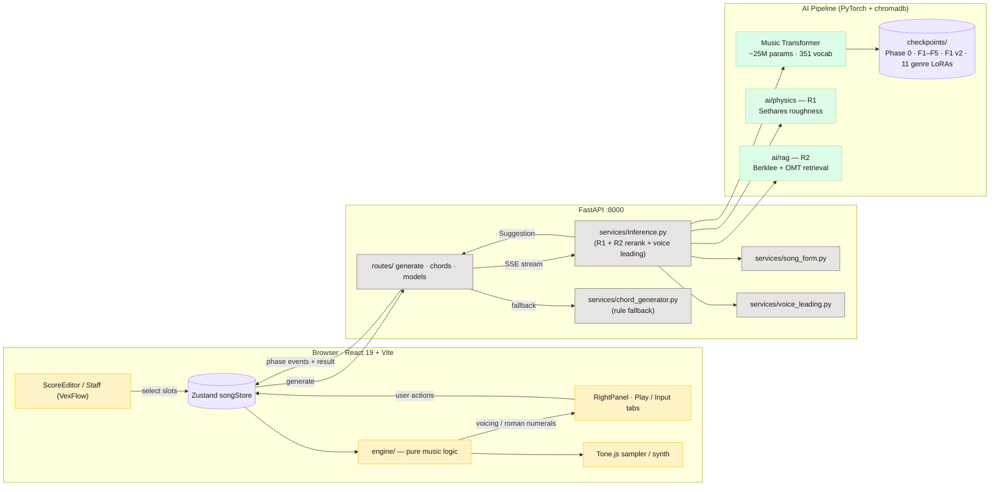
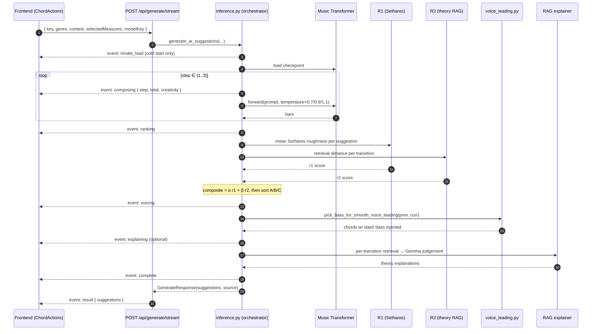
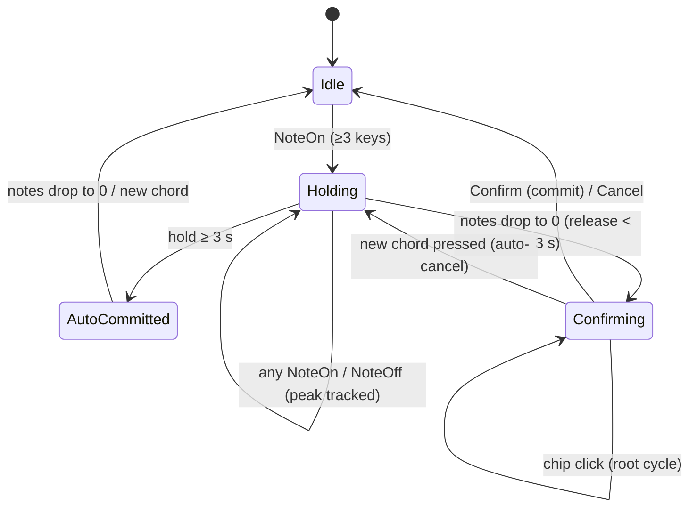

<h1 align="center">TheArtist</h1>

<p align="center">
  <em>An AI chord-composition tool for musicians — write progressions on an interactive staff, get suggestions from a custom-trained Music Transformer, and see voice-leading visualised in real time.</em>
</p>

<p align="center">
  <a href="https://arxiv.org/abs/2605.04998"></a>
  <a href="https://arxiv.org/abs/2606.07334"></a>
  <a href="https://huggingface.co/PearlLeeStudio"></a>
  <a href="https://youtu.be/iSDj4VK9nKc"></a>
  <a href="LICENSE"></a>
  <a href="https://huggingface.co/PearlLeeStudio"></a>
  
</p>

<p align="center">
  
</p>

<p align="center"><sub>
Interactive staff (left) with chord progression · resizable right panel (right) with playback, drums, voicing, and MIDI / AI / manual input · Music Transformer suggestions ranked by Sethares physics + dual-corpus theory retrieval (Berklee Jazz + Open Music Theory).
</sub></p>

<p align="center">
  <a href="https://youtu.be/iSDj4VK9nKc">
    
  </a>
</p>

<p align="center"><sub>
▶ <a href="https://youtu.be/iSDj4VK9nKc">Watch the demo on YouTube</a> — staff editor, MIDI hold-to-commit, AI generation with live SSE progress, voice-leading inversions, and per-genre LoRA playback across the 13-genre vocabulary.
</sub></p>

## Links

| | |
|---|---|
| 🎬 **Demo videos** | [youtube.com/@StudioPearlLee](https://www.youtube.com/@StudioPearlLee) |
| 🤗 **Released models** | [huggingface.co/PearlLeeStudio](https://huggingface.co/PearlLeeStudio) — 7 base checkpoints + 11 LoRA adapters |
| 📄 **Paper / technical report** | [arXiv:2605.04998](https://arxiv.org/abs/2605.04998) · [arXiv:2606.07334](https://arxiv.org/abs/2606.07334) |
| 💼 **Author** | [linkedin.com/in/pearlmedicilee](https://www.linkedin.com/in/pearlmedicilee) |

---

## What it does

| | |
|---|---|
| **Compose on a staff** | VexFlow notation, click to select measures, drag-select ranges, slash-chord support |
| **Generate with a paper-trained model** | F1 default (10K pop mix); the released F1 base is weight-identical to the Phase 0 pop baseline (~84.2% pop / 72.9% jazz top-1 — a checkpoint-selection artifact), and the selection-corrected `ft_f1_v2` retrain (83.7% pop / 80.3% jazz) restores the jazz adaptation; F1–F5 + F1 v2 + Phase 0 baseline + 11 LoRA adapters (13-genre vocabulary) selectable |
| **Live progress streaming** | `/api/generate/stream` SSE pipeline shows each phase (Read → Load → Compose → Rank → Voice → Theory → Done) as the model thinks |
| **Two-axis rerank** | R1 — Sethares sensory roughness (physics) · R2 — music theory retrieval over Berklee Book of Jazz Harmony + Open Music Theory v2 (jazz-family genres → Berklee, classical → OMT, merge by distance). Both scores combine into the Option A/B/C ordering. |
| **Voice-leading inversions** | Post-process injects slash-chord inversions (e.g. `Am7/C`) where they smooth the bass line — the LM only emits root-position chords, voice leading is added on top |
| **MIDI input with confirm flow** | Hold a chord ≥3 s → auto-commit · release early → Confirm card with root-cycling chips, slash-chord inversion detection, and a 3-chord transition view (prev → curr → next + voice-leading arrows) |
| **Audio playback** | Tone.js + smplr (GM Soundfont samples) — sampled piano, sampled GM guitars / keys / strings + 15 drum pattern presets (sampled kits + smplr drum-machine voices). Switch instruments live mid-playback. |
| **Dark + light theme** | Editorial near-black dark / pure-achromatic light. Single `--brand-yellow` drives every active state. |
| **Resizable right panel** | Drag the boundary 240–640 px wide; collapse with a short tab-aligned toggle. |
| **Rule-based fallback** | If models or chromadb fail to load, the API drops to a rule-based generator so the staff always responds. |

## Walkthrough

### AI generation with live progress



Click **Generate** with a slot range selected. The right panel streams pipeline phases via SSE — *Read → Compose 1/3 → 2/3 → 3/3 → Rank → Voice → Done* — so the sub-second warm inference window (~0.4–0.9 s warm p50, first progress in ~110 ms; measured CPU-only) narrates itself. Three suggestions land, ranked by R1 (Sethares roughness) + R2 (theory-corpus retrieval) composite score. Click any to apply, swap freely. The model dropdown lists the 11 per-genre LoRA adapters (R4 expansion) alongside the F-series paper checkpoints and the selection-corrected F1 retrain (F1 / F1 v2 ⭐ pop-leaning · F4 ⭐ jazz-leaning recommended).

### MIDI input



Pick a slot on the staff, hit **Enable MIDI** with a connected keyboard. Hold a chord on the keys for ≥3 s and it auto-commits to the slot (and the selection auto-advances to the next one). Release early and you get a Confirm card with root-cycling chips — `C6` ↔ `Am7/C` etc. — that reflect the actual played bass, plus inversion detection for slash chords. The Confirm card also shows a 3-chord transition view: prev (purple strip below the keyboard) → current candidate (yellow fill) → next (green strip above), with curved voice-leading arrows tracing how each voice moves.

### Voicing — piano + guitar



Whichever chord is active (selected on the staff, currently playing back, or under a MIDI hold) lights up its tones on a styled keyboard or fretboard. Voicings cap at 4 notes — for tension chords (9 / 11 / 13 / altered dominants) the 5th drops, keeping the hand realistic and leaving register room for future melody lines. Switch instruments live; the playback engine swaps mid-song.

### Dark + light themes

<table>
<tr>
<td width="50%" valign="top"></td>
<td width="50%" valign="top"></td>
</tr>
<tr>
<td><sub><strong>Light</strong> — pure-achromatic R=G=B ramp on Tailwind's neutral axis. The page is paper-white; every chrome surface is a tonal grey.</sub></td>
<td><sub><strong>Dark</strong> — near-black editorial palette. Page sits at #0a0a0a; ladder of #121 / #1a1 / #242 / #262 above it for surfaces, buttons, borders.</sub></td>
</tr>
</table>

Both modes reserve a single warm hue — `--brand-yellow` (#facc15) — for active state across Play/Input tabs, panel toggle, focus rings, `::selection`, voicing highlight, and the MIDI Confirm card's chip row. Accent green is reserved for live MIDI input; the playback wash is the only other warm tone, and only fires under the cursor.

## Architecture

### High level



### `/api/generate/stream` — five-stage pipeline



### MIDI input state machine



### Module layout

```
TheArtist/
├── frontend/src/
│   ├── components/
│   │   ├── ScoreEditor/Staff.tsx              # VexFlow staff
│   │   └── RightPanel/
│   │       ├── PlaybackControls / DrumSelector / SongSettings
│   │       ├── ChordActions.tsx               # AI Generate flow + manual chord
│   │       ├── GenerateProgress.tsx           # 7-stage SSE progress chips
│   │       ├── MidiStatus.tsx                 # MIDI input PRESENTER (216 LOC)
│   │       ├── useMidiCapture.ts              # MIDI state machine HOOK (317 LOC)
│   │       ├── ChordTransitionView.tsx        # 3-chord voice-leading view
│   │       ├── PianoKeyboard.tsx / GuitarFretboard.tsx / VoicingViewer.tsx
│   │       └── ThemeToggle.tsx
│   ├── engine/                                # pure music logic, no React deps
│   │   ├── chordParser.ts · chordDisplay.ts   # symbol parsing + display parts
│   │   ├── voicingEngine.ts                   # 4-note voicing tables
│   │   ├── romanNumeral.ts                    # diatonic + Roman numerals
│   │   ├── playback.ts                        # Tone.js scheduling
│   │   ├── midiInput.ts                       # Web MIDI API + chord detection
│   │   ├── chordGenerator.ts                  # /api/generate/stream client
│   │   ├── sseStream.ts                       # generic SSE frame reader
│   │   ├── arrangement.ts                     # per-genre harmony/bass comping rhythm
│   │   ├── drums.ts                           # 15 drum-pattern presets (sampled + synth fallback)
│   │   ├── instruments.ts                     # smplr GM Soundfont registry
│   │   ├── midiExport.ts                      # @tonejs/midi export
│   │   ├── constants.ts                       # note-value / root tables
│   │   └── slotNav.ts                         # slot arithmetic helpers
│   └── store/                                 # Zustand stores: songStore (song) ·
│                                              #   generationStore (generate panel) · sessionStore (saved sessions)
├── backend/app/
│   ├── routes/                                # generate · chords · song · models
│   └── services/
│       ├── inference.py                       # 5-stage orchestrator (compose →
│       │                                      #   rank → voice-lead → explain)
│       ├── voice_leading.py                   # bass-smoothing inversion injection
│       ├── song_form.py                       # cadence post-processor
│       ├── song_builder.py                    # 3-track harmony/bass/drum events
│       └── chord_generator.py                 # rule-based fallback
└── ai/
    ├── training/model.py · tokenizer.py       # Music Transformer + chord tokenizer (serving)
    ├── physics/                               # R1 — Sethares + Stolzenburg
    ├── rag/                                   # R2 — dual-corpus theory pipeline (Berklee + OMT)
    └── checkpoints/                           # gitignored — fetched from HuggingFace
```

**Data flow.** User edits chords on the staff → selects measures → frontend POSTs to `/api/generate/stream`. Backend loads the chosen checkpoint, runs the model at three temperatures, scores candidates by α·R1(Sethares) + β·R2(Berklee + Open Music Theory retrieval), injects voice-leading inversions where the bass line wants smoothing, applies song-form cadence rules, and returns three Suggestions. The frontend parses each, computes voicings and Roman numerals client-side, and Tone.js plays the result. SSE phase events drive the progress UI throughout.

## Tech Stack

| Layer | Technologies |
|-------|-------------|
| **Frontend** | React 19, TypeScript (strict), Vite 8, Tailwind CSS 4, Zustand 5, VexFlow 5, Tone.js 15, smplr (GM Soundfont + drum machines), @tonejs/midi |
| **Backend** | FastAPI, Pydantic v2, Uvicorn, Python 3.12+ |
| **AI/ML** | PyTorch 2.5+, Music Transformer (custom), music21, HuggingFace Datasets, TensorBoard, pypdf (RAG ingestion) |
| **Dev Tools** | uv (Python), npm, ESLint |

## Getting Started

### Prerequisites

- Node.js 18+
- Python 3.12+ with [uv](https://docs.astral.sh/uv/)
- (Optional) NVIDIA GPU with CUDA 12.1 — inference also runs CPU-only

### Installation

```bash
# Clone the repository
git clone https://github.com/PearlLeeStudio/TheArtist.git
cd TheArtist

# Frontend
cd frontend
npm install

# Backend
cd ../backend
uv sync

# AI env (optional — only needed to rebuild the R2 theory corpus)
cd ../ai
uv sync

# Model checkpoints — download trained weights from HuggingFace so the backend
# serves real models (skip this and it falls back to a rule-based generator).
# Public repos (CC BY-NC, no token); ~2.2 GB into ai/checkpoints/.
cd ..
uv run --with huggingface_hub python model/_download.py            # all 18 (7 F-series + 11 LoRA)
# uv run --with huggingface_hub python model/_download.py --smoke  # just F1 (the default) for a fast start
```

### Running Locally

Start the backend and frontend in separate terminals:

```bash
# Terminal 1 — Backend (port 8000)
cd backend
uv run uvicorn app.main:app --reload

# Terminal 2 — Frontend (port 5173)
cd frontend
npm run dev
```

Vite proxies `/api` requests to the backend automatically. Open `http://localhost:5173` in your browser.

To preload AI models on startup:

```bash
THEARTIST_WARMUP=1 uv run uvicorn app.main:app --reload
```

## AI Model

TheArtist serves a custom Music Transformer (~25M parameters) from a pop→jazz genre-adaptation study ([arXiv:2605.04998](https://arxiv.org/abs/2605.04998)). The Pop / Jazz top-1 columns are each run's best-epoch training-log metrics; note that the *released* F1 base coincides with Phase 0 (see the F1 row and note below):

| Run | Data | Focus | Pop top-1 | Jazz top-1 |
|-----|------|-------|----------:|-----------:|
| **Phase 0** | Chordonomicon + Billboard, ~544K songs × 3 ep | Pop baseline | 84.21% | 72.86% |
| **F1** `ft_jazz_pop80` | Phase 0 + 10K pop mix | Preserve pop (paper run) | **84.60%** | 81.03% |
| **F1 v2** `ft_jazz_pop80_v2` | Phase 0 + 10K pop mix (jazz_val-selected) | Selection-corrected F1 (served as `ft_f1_v2`) | 83.73% | 80.31% |
| **F2** `ft_jazz_pop67` | Phase 0 + 5K pop mix | Balanced | 84.06% | 79.91% |
| **F3** `ft_jazz_pop50` | Phase 0 + 2.5K pop mix | Paper sweet-spot finding (no longer default) | 84.20% | 80.99% |
| **F4** `ft_jazz_pop29` | Phase 0 + 1K pop mix | Jazz-leaning | 83.02% | 81.50% |
| **F5** `ft_jazz_only` | Phase 0 + 0 pop | Jazz only (catastrophic forgetting) | 82.10% | 81.30% |

> **F1 served-weights note (2026-06-11).** The *released* F1 `best.pt` is weight-identical to Phase 0 — a best-checkpoint-selection artifact (a seed/data-dependent worst case where min-mixed-val selection retained the un-adapted init, not a deterministic outcome), so the served v1 F1 evaluates at the Phase 0 numbers (84.21% pop / 72.86% jazz); the 84.60 / 81.03 above are the paper's epoch-6 training-log figures, never released as `best.pt`. The selection-corrected retrain `ft_jazz_pop80_v2` (`select_best_on: jazz_val`, served as `ft_f1_v2`) is hash-distinct from Phase 0 and embodies the intended jazz adaptation; the 11 LoRA adapters remain paired with the v1 base.

> **Jazz top-1 comparability note.** The F-series and `ft_f1_v2` Jazz top-1 figures in the table above are measured on the **6-source jazz test (167 seqs)** and are **not** directly comparable to the expanded **9-source jazz test (501 seqs)** used for multi-seed validation: the same `ft_jazz_pop80_v2` weights score 80.31 on the 6-src test but 75.05 on the 9-src test, and the matched-data 9-src multi-seed retrains {seeds 42, 123, 7; n=3} land at jazz top-1 75.76 ± 0.03 (per-seed 75.78 / 75.78 / 75.72), all hash-distinct from Phase 0. Compare like-for-like within a single test set only.

The backend defaults to F1 (`ft_f1`, pop-preserving baseline). Recommended ⭐ picks are F1 / F1 v2 (pop-leaning) and F4 (jazz-leaning). F3 — the paper's sweet-spot finding — remains served but is no longer the default. The model selector exposes the other paper checkpoints + the selection-corrected `ft_f1_v2` + 11 LoRA per-genre adapters covering the 13-genre vocabulary (jazz/pop run on the F-series base directly).

These weights are gitignored — they live on HuggingFace as public repos under [PearlLeeStudio](https://huggingface.co/PearlLeeStudio) (seven F-series base — incl. the selection-corrected F1 v2 retrain `ft-pop80-v2` — + eleven LoRA adapters, CC BY-NC). Fetch them into `ai/checkpoints/` with `uv run --with huggingface_hub python model/_download.py`; without them the backend serves rule-based fallback.

### Physics-grounded re-rank and theory RAG

The MT is treated as a learned-likelihood prior. Two layers ride on top to choose between candidates:

- **R1 — Sensory-consonance physics.** [`ai/physics/`](ai/physics/) implements Sethares (1993) roughness (`chord_consonance.py`), Stolzenburg (2015) periodicity (`periodicity.py`), a two-axis composite (`composite.py`), and diversity proxies (`diversity.py`). The composite restores tonal orderings that pure Sethares misses (M3 < Tritone, C major < C minor, C7 < Cdim7). The backend (`backend/app/services/inference.py`) reorders candidates by a composite score (R1 mean roughness + R2 theory-retrieval distance, α·R1 + β·R2 with α=β=1) before returning.
- **R2 — Theory RAG.** [`ai/rag/`](ai/rag/) is a five-stage pipeline — extract → chunk → embed (Snowflake arctic-embed-l-v2) → tag (local LLM via ollama) → retrieve. Two corpora are indexed: **Berklee Book of Jazz Harmony** (268 chunks, chromadb collection `berklee`, jazz-specific harmony) and **Open Music Theory v2** (1,198 chunks, collection `openmusictheory`, classical + general harmony — Picardy third, Neapolitan, augmented sixth, plagal/half cadence, modal mixture, modulation). The Retriever queries both and merges by cosine distance; gating routes jazz-family genres to Berklee primary, classical to OMT primary. `rag.coherence` scores each transition as an LLM-grounded yes/no; `rag.explain` produces human-readable theory explanations citing chapter/page from the most relevant book (both run gemma3:4b via ollama at inference time — gemma3:4b was the largest judge that fit the original 8 GB GPU; the live demo now runs CPU-only with explanations off).

The R1 / R2 layers are systems engineering on top of the learned LM — applying physics and music theory to candidate selection; they add a consonance/theory axis orthogonal to model likelihood (by construction, R1 scores sensory consonance rather than next-chord accuracy), but the mix-ratio paper covers only the training study.

The training and evaluation pipeline itself is not part of this repository — the experiments (mix-ratio sweep, 13-genre LoRA grid, rank sweep, multi-seed validation) are documented in [arXiv:2605.04998](https://arxiv.org/abs/2605.04998) and [arXiv:2606.07334](https://arxiv.org/abs/2606.07334), and the per-model evaluation summaries live on the [HuggingFace model cards](https://huggingface.co/PearlLeeStudio).

## Datasets

### Training corpora

| Dataset | Songs (used) | Genre | License |
|---|---:|---|---|
| [Chordonomicon](https://huggingface.co/datasets/ailsntua/Chordonomicon) | ~679K | Pop / rock + community-tagged subsets (country, alt, rap, soul, electronic) | CC BY-NC 4.0 |
| [McGill Billboard](https://ddmal.music.mcgill.ca/research/The_McGill_Billboard_Project_(Chord_Analysis_Dataset)/) | ~890 | Pop / rock | CC0 |
| [Jazz Harmony Treebank (JHT)](https://github.com/DCMLab/JazzHarmonyTreebank) | ~1,170 | Jazz | Public |
| [Weimar Jazz Database (WJazzD)](https://jazzomat.hfm-weimar.de/) | ~283 | Jazz | ODbL |
| [JAAH](https://mtg.github.io/JAAH/) | ~113 | Jazz | Research |
| [JazzStandards / iReal-derived](https://github.com/mikeoliphant/JazzStandards) | ~293 | Jazz | Community corpus |
| [Bach 371 chorales (via music21)](https://web.mit.edu/music21/) | 371 | Tonal chorales (used as the "classical" LoRA target) | Public domain |

Raw datasets are **not redistributed** in this repo. Chordonomicon is CC BY-NC; the others have their own per-source terms. Acquire each from the upstream link above.

For the LoRA expansion, the 11 target genres draw from Chordonomicon's genre-labeled subsets; see paper §4 for selection-bias notes (e.g., the "electronic" slice is biased toward synthwave / melodic house, "hip-hop" toward jazz-rap / neo-soul).

### Theory retrieval (R2 RAG)

The reranking layer indexes two corpora:

- **Berklee Book of Jazz Harmony** — copyrighted, **not redistributed**. `ai/rag/_setup_corpora.sh` requires you to supply your own legitimate copy.
- **Open Music Theory v2** — [open license](https://viva.pressbooks.pub/openmusictheory/), re-ingested from the upstream source by the setup script.

The PDF text extraction, paragraph chunking, embedding (Snowflake `arctic-embed-l-v2`), and topic tagging (local LLM via ollama) pipeline lives in [`ai/rag/`](ai/rag/).

## Project Structure

```
TheArtist/
├── frontend/src/
│   ├── components/         # React UI (ScoreEditor/, RightPanel/)
│   ├── engine/             # Pure music logic (no React deps): chordParser,
│   │                       # voicingEngine, romanNumeral, playback, midiInput
│   ├── store/              # Zustand stores: songStore (song), generationStore (generate), sessionStore (saved sessions)
│   └── models/types.ts     # TypeScript interfaces
├── backend/app/
│   ├── routes/             # API endpoints
│   ├── services/           # inference.py (model serving), chord_generator (rule fallback),
│   │                       # song_form + song_builder + voice_leading (post-processors)
│   └── models/schemas.py   # Pydantic request/response
├── ai/
│   ├── training/
│   │   ├── model.py        # Music Transformer definition (serving-side)
│   │   └── tokenizer.py    # 351-token chord tokenizer
│   ├── physics/            # R1 — Sethares roughness + Stolzenburg periodicity +
│   │                       # composite, voicing, chord-candidate rerank,
│   │                       # diversity proxies, ordering sanity script
│   ├── rag/                # R2 — extract (pypdf) → chunk → embed (arctic-v2 +
│   │                       # chromadb) → tag (LLM via ollama) → retrieve;
│   │                       # coherence scorer + explain CLI
│   └── checkpoints/        # gitignored — fetch from HuggingFace via model/_download.py
├── model/_download.py      # Fetches the 18 released checkpoints from
│                           # huggingface.co/PearlLeeStudio into ai/checkpoints/
├── screenshot/             # README hero image + UI captures
├── API_SPEC.md             # Frontend ↔ backend contract
└── LICENSE
```

## API

| Endpoint | Method | Description |
|----------|--------|-------------|
| `/api/health` | GET | Health check |
| `/api/generate` | POST | Generate AI chord suggestions for selected measures (score editor 3-suggestion path) |
| `/api/generate/chords` | POST | Programmatic chord-only generation (flat bar list) — debug / fine-control callers |
| `/api/generate/song` | POST | **Voyager primary (composite, live).** Input `{genre, length_bars}` — artist owns key/bpm/time-sig internally and returns the full 3-track render (harmony + bass + drum + base64 MIDI). [Quick start ↓](#voyager-api-quick-start). |
| `/api/models/list` | GET | List available checkpoints (F1–F5 + F1 v2 + Phase 0 + 11 genre LoRAs) |
| `/api/models/status` | GET | Check loaded model status |
| `/api/models/warmup` | POST | Preload models into memory |

See [API_SPEC.md](API_SPEC.md) for the full request/response contract.

### Voyager API quick start

`POST /api/generate/song` is the single endpoint voyager calls. Send a genre and length; receive a full 3-track render. Artist picks the key, BPM, time signature, chord-generation checkpoint, and per-track instruments — voyager owns mood→genre upstream and audio rendering downstream.

**1) Curl smoke-test**

```bash
curl -sS http://localhost:8000/api/generate/song \
  -H 'Content-Type: application/json' \
  -d '{"genre": "jazz", "length_bars": 8}' | jq '.key, .bpm, .model_used, (.tracks | keys)'
```

```
"F major"
110
"ft_f4"
[
  "bass",
  "drum",
  "harmony"
]
```

**2) Python client (example shape)**

```python
import base64
import io
import requests
import pretty_midi   # caller-side render

BASE = "http://localhost:8000"

def generate_song(genre: str, length_bars: int = 8) -> dict:
    r = requests.post(f"{BASE}/api/generate/song", json={
        "genre": genre,
        "length_bars": length_bars,
    })
    r.raise_for_status()
    return r.json()

def to_pretty_midi(song: dict) -> pretty_midi.PrettyMIDI:
    return pretty_midi.PrettyMIDI(io.BytesIO(base64.b64decode(song["midi_b64"])))

song = generate_song("country", length_bars=4)
print(song["bars"])               # [{"chords": [...]}, ...]
print(song["tracks"]["harmony"]["instrument"])   # "acoustic_guitar_steel"
midi = to_pretty_midi(song)       # ready for a soundfont render
```

**3) Request fields** (`SongGenerateRequest`)

| Field | Type | Required | Default | Notes |
|---|---|---|---|---|
| `genre` | string | ✓ | — | One of `jazz, pop, rock, blues, bossa, classical, country, rnb_soul, hip_hop, electronic, funk, folk, gospel`. 400 if not in list. |
| `length_bars` | int | — | `8` | Range 1–64. |
| `n_candidates` | int | — | `1` | Reserved 1–3. Current build returns 1. |
| `seed` | int \| null | — | `null` | Reserved for deterministic sampling. |

**4) Response shape** (`SongGenerateResponse` — top-level keys)

| Key | Type | Description |
|---|---|---|
| `genre` | string | Echo of request. |
| `key` | string | Picked from `GENRE_DEFAULTS` — e.g. jazz→`F major`, electronic→`A minor`. |
| `bpm` | int | Picked from `GENRE_DEFAULTS` — e.g. blues→90, electronic→128. |
| `time_signature` | `[int, int]` | `[4, 4]` for all 13 genres in v1. |
| `bars` | `[{"chords": [str, str]}]` | Two chord slots per bar. Slot 0 covers `[0, beats/2)`, slot 1 covers `[beats/2, beats)`. |
| `tracks.harmony.events[]` | `[TrackEvent]` | Chord voicing struck on the genre's 1-bar comping rhythm. Each event = `{bar, beat, pitch, duration, velocity}`. |
| `tracks.bass.events[]` | `[TrackEvent]` | Chord root struck on `GENRE_BASS_RHYTHM` positions, anchored at MIDI 36 (C2). |
| `tracks.drum.events[]` | `[TrackEvent]` | Per-genre pattern. `voice` is `K`/`S`/`H`/`O`/`X`/`C`/`R`/`T`/`M`/`L`; `pitch` is `null`. |
| `tracks.<name>.instrument` | string | GM Soundfont name (e.g. `electric_piano_1`, `contrabass`) for harmony/bass; `gm_drum_kit` for drum. |
| `tracks.<name>.source` | `"rule"` | All three layers rule-based in v1. |
| `midi_b64` | string | Convenience MIDI render. 4 internal tracks: meta (tempo+time-sig), harmony ch 0, bass ch 1, drum ch 9. |
| `model_used` | string | Chord-generation checkpoint (`ft_f4`, `ft_f1_lora_country`, …) or `"rules"` if the AI path was unavailable. |

Drum voice letters → GM percussion (channel 10) mapping lives in `backend/app/services/genre_tables.py:DRUM_VOICE_TO_GM_NOTE` if you want to remap to a custom kit.

**5) Genre defaults table** (artist's internal picks)

| Genre | Key | BPM | Harmony instrument | Bass instrument | Drum |
|---|---|---|---|---|---|
| jazz | F major | 110 | electric_piano_1 (Rhodes) | contrabass | Jazz Swing |
| pop | C major | 110 | acoustic_grand_piano | electric_bass_finger | Pop |
| rock | E major | 120 | overdriven_guitar | electric_bass_finger | Rock Anthem |
| blues | E major | 90 | electric_guitar_clean | electric_bass_finger | Blues Shuffle |
| bossa | F major | 110 | acoustic_guitar_nylon | contrabass | Bossa |
| classical | C major | 80 | acoustic_grand_piano | contrabass | Classical |
| country | G major | 100 | acoustic_guitar_steel | electric_bass_finger | Country |
| rnb_soul | Bb major | 90 | electric_piano_1 | electric_bass_finger | R&B / Soul |
| hip_hop | A minor | 90 | electric_piano_1 | electric_bass_finger | Hip-hop |
| electronic | A minor | 128 | pad_2_warm | electric_bass_finger | Electronic |
| funk | F major | 110 | electric_guitar_clean | electric_bass_finger | Funk 16 |
| folk | G major | 100 | acoustic_guitar_steel | contrabass | Folk / Ballad |
| gospel | F major | 90 | hammond_organ | electric_bass_finger | Gospel |

The full per-genre 1-bar harmony / bass rhythm patterns live in `frontend/src/engine/arrangement.ts:GENRE_HARMONY_RHYTHM` (mirrored in `backend/app/services/genre_tables.py`).

**6) Errors**

| Status | Body | When |
|---|---|---|
| 400 | `{"detail": "Unsupported genre '<x>'. Expected one of: ..."}` | Genre not in the 13-genre vocabulary. |
| 422 | Pydantic validation | `length_bars` out of `[1, 64]`, missing `genre`, etc. |

For the older `/api/generate/chords` programmatic chord-only endpoint (no arrangement), see [API_SPEC.md](API_SPEC.md).

## Research

- **arXiv preprint** — *Empirical Study of Pop and Jazz Mix Ratios for Genre-Adaptive Chord Generation*, Lee, 2026, [arXiv:2605.04998](https://arxiv.org/abs/2605.04998).
- **arXiv technical report** — *How Far Can Chord-Symbol Time-Series Adaptation Carry Genre Identity?*, Lee, 2026, [arXiv:2606.07334](https://arxiv.org/abs/2606.07334).
- **HuggingFace** — seven F-series base checkpoints (incl. the selection-corrected F1 v2 retrain) + eleven LoRA adapters at [huggingface.co/PearlLeeStudio](https://huggingface.co/PearlLeeStudio); download into `ai/checkpoints/` with `model/_download.py`. Per-model evaluation summaries (real-song matrix, LoRA rank sweep) live on the model cards.

### Citation

```bibtex
@misc{lee2026chordmix,
  title         = {Empirical Study of Pop and Jazz Mix Ratios for Genre-Adaptive Chord Generation},
  author        = {Lee, Jinju},
  year          = {2026},
  eprint        = {2605.04998},
  archivePrefix = {arXiv}
}

@misc{lee2026genreidentity,
  title         = {How Far Can Chord-Symbol Time-Series Adaptation Carry Genre Identity?},
  author        = {Lee, Jinju},
  year          = {2026},
  eprint        = {2606.07334},
  archivePrefix = {arXiv}
}
```

## Not in this repository

- **Training / evaluation pipeline** — the experiments are fully documented in the two papers; per-model eval summaries live on the HuggingFace model cards.
- **Paper sources** — the papers themselves are on arXiv (links above); LaTeX sources and research notes are private.
- **Trained checkpoints** — published on [HuggingFace](https://huggingface.co/PearlLeeStudio) (CC BY-NC 4.0), fetched via `model/_download.py`.
- **Raw datasets** — license + size constraints; see [Datasets](#datasets) for upstream sources.
- **Berklee Book of Jazz Harmony PDF** — copyrighted; supply your own copy to rebuild the R2 `berklee` corpus.
- **Internal design notes, deliberation logs, and roadmap drafts** — private.

## License

**Code: [MIT](LICENSE)** © 2026 Jinju Lee (PearlLeeStudio).

The released model checkpoints are distributed separately on [HuggingFace](https://huggingface.co/PearlLeeStudio) under **CC BY-NC 4.0** (they derive from the CC BY-NC Chordonomicon corpus) — non-commercial paper / portfolio / demo use only. Bundled GPL-3.0 drum samples keep their own license ([frontend/public/drums/LICENSE.txt](frontend/public/drums/LICENSE.txt)). Raw datasets are not redistributed — see [Datasets](#datasets).

Contact: pearl1379@gmail.com
